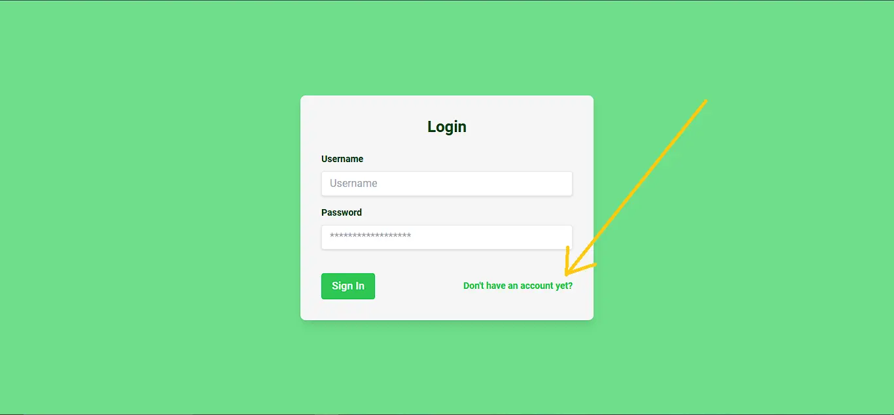
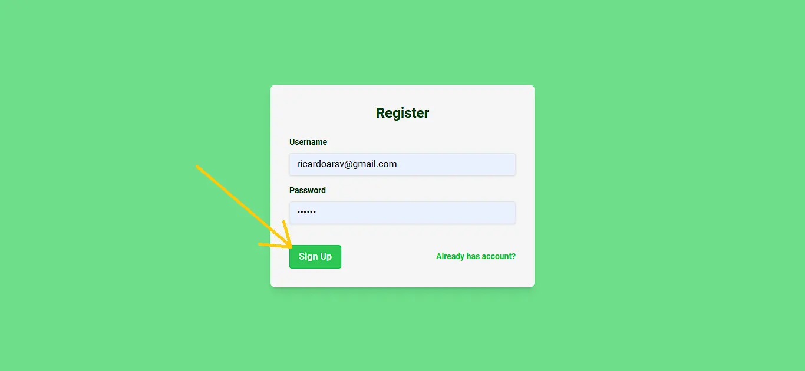

# NutriChatAI API-REST

Aplicacion web que provee un chat interactivo con una IA, para preguntas relacionadas con la nutricion, puedes crear una cuenta para llevar un registro de tus convesaciones, iniciar sesion y continuar donde lo dejaste, leer el hilo de tus mensajes y recibir respuestas a tiempo real a tus preguntas 😀😁

## Project Structure

root/  
├── assets/  
│ └── img/  
│ └── Register1.webp  
│ └── Register2.webp  
│ └── Register3.webp  
├── NutriChat-Frontend/  
│ ├── mock/  
│ │ └── messages.json  
│ ├── src/  
│ │ ├── components/  
│ │ │ └── Chat/  
│ │ │ │ │ └── Chat.jsx  
│ │ │ │ │ └── ChatInput.jsx  
│ │ │ └── Header.jsx  
│ │ │ └── WelcomeMessage.jsx  
│ │ ├── pages/  
│ │ │ └── ChatBot.jsx  
│ │ │ └── Login.jsx  
│ │ │ └── Register.jsx  
│ │ ├── UI/  
│ │ │ └── alert.modal.jsx  
│ │ │ └── ChatBubbles.jsx  
│ │ │ └── messages.skeleton.jsx  
│ │ ├── utils/  
│ │ │ └── getUser.jsx  
│ │ │ └── logoutUser.jsx  
│ │ │ └── saveUser.jsx  
│ │ │ └── UserContext.jsx  
│ │ ├── app.jsx  
│ │ ├── index.css  
│ │ └── Main.jsx  
│ ├── .prettierignore  
│ ├── .prettierrc  
│ ├── index.html  
│ ├── Readme.md  
│ ├── package.json  
│ ├── package-lock.json  
│ ├── postcss.config.cjs  
│ └── tailwind.config.js  
├── NutriChat-Backend/  
│ ├── src/  
│ │ ├── config/  
│ │ │ └── firebase.js  
│ │ │ └── openAi.js  
│ │ ├── controllers/  
│ │ │ └── auth.controller.js  
│ │ │ └── ia.controller.js  
│ │ │ └── messages.controller.js  
│ │ ├── models/  
│ │ │ └── auth.model.js  
│ │ │ └── ia.model.js  
│ │ │ └── messages.model.js  
│ │ │ └── server.model.js  
│ │ ├── routes/  
│ │ │ └── auth.routes.js  
│ │ │ └── ia.routes.js  
│ │ │ └── messages.routes.js  
│ │ ├── utils/  
│ │ │ └── validateMessage.js  
│ ├── .env  
│ ├── index.js  
│ ├── Readme.md  
│ └── package.json  
└── README.md

## Installation

1. **Clona el repositorio**:

   ```bash
   git clone https://github.com/Ricardoarsv/NutriChatAI.git
   ```

2. **abre 2 terminales y en cada una accede a la carpeta del proyecto**:

   ```bash
   cd NutriChat-Backend
   ```

   ```bash
   cd NutriChat-Frontend
   ```

3. **Instala las dependencias en ambos terminales**:

   ```bash
   npm install
   ```

4. **Establece las variables de entorno para el backend**:
   Create a `.env` file in the root directory and configure your environment variables. For example:

   ```env
        PORT=3000
        OPENAI_API_KEY=
        APIKEY=
        AUTHDOMAIN=
        PROJECTID=
        STORAGEBUCKET=
        MESSAGINGSENDERID=
        APPID=
   ```

5. **Ejecuta el comando para correr el servidor en modo desarrollo en ambos terminales**:
   ```bash
   npm run dev
   ```

## Usage

**TestData**

- **Usuario: test@email.com**: Usuario con hilo de chat para visualizacion
- **Contraseña: 123456**: Usuario con hilo de chat para visualizacion

1. **Crea una cuenta**:
   
2. **Inicia sesion**:
   

3. **Empieza a chatear**:
   

4. **Empieza a chatear**:
   <video width="600" controls>
     <source src="./assets/videos/Project_Finished.webm" type="video/webm">
     Your browser does not support the video tag.
   </video>

## Scripts

- **`npm run dev`**: En backend Inicia el servidor con nodemon, para observar los cambios en archivos.
- **`npm run dev`**: En frontend Inicia el servidor con vite, para observar los cambios en archivos.

## Dependencies

**Backend**

- **express**: Framework de node.js.
- **picocolors**: Libreria para llenar de vida la consola.
- **dotenv**: Modulo para cargar los archivos `.env`.
- **cors**: Middleware para habilitar las (CORS).
- **firebase**: Modulo de autentificacion y base de datos.
- **openai**: libreria para utilizar el modelo de GTP.

**Frontend**

- **fortawesome/free-solid-svg-icons:**: Iconos sólidos gratuitos de FontAwesome.
- **fortawesome/react-fontawesome**: Componentes de React para usar iconos de FontAwesome.
- **autoprefixer**: Herramienta para agregar prefijos específicos del navegador a CSS.
- **framer-motion**: Librería para animaciones en React.
- **react-dom**: Paquete para trabajar con el DOM en React.
- **react-router-dom:**: Enrutador para aplicaciones React.
- **tailwindcss**: Framework de CSS para diseño rápido.

## Dev Dependencies

- **nodemon**: Reinicia automaticamente el servidor al detectar cambios en archivos.
- **standard**: Guia standar de formato de codigo JavaScript.

---

Desarrollado por **RicardoArsv**.
